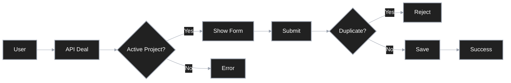

# Serverless Data Collection & Validation System

[Türkçe okumak için tıklayın (Click to read in Turkish)](readme.tr.md)

Modern investment processes often suffer from fragmented and error-prone data collection workflows. This project addresses these challenges by digitizing end-to-end presale operations, prioritizing data integrity, and leveraging Google Sheets as a dynamic database for application management.

## 1. Purpose and Approach

The core objective is to centralize community-driven investment applications while ensuring speed, data accuracy, and operational simplicity. The architecture goes beyond simple form submission, it implements dynamic project management mechanisms and prevents duplicate entries to maintain the highest data quality standards.

## 2. Operational Architecture and Data Strategy

The system operates through three fundamental stages of data extraction, validation, and processing from Google Sheets:

- **Dynamic Data Extraction**: The application dynamically filters active investment opportunities (deals) from Sheets using visibility flags, presenting only relevant options to users.

- **Business Rules and Validation**: To prevent data pollution, the system implements validation at the application layer. Duplicate submissions from the same wallet address for the same project are blocked before reaching the database level.

- **Write and Reporting (Load)**: Successfully validated form data is written to the central table with timestamps, enabling real-time reporting for operations teams.

### 2.1. System Flow Diagram

## 3. Data Sources and Flow Model

The following table summarizes the data traffic sources and processing methods within the system:

| Sheet | Function | Data Direction | Technical Approach |
| :--- | :--- | :--- | :--- |
| **Deals** | Active Project Management | Input (Read) | Dynamic Filtering (Active Flag) |
| **Submissions** | Application Storage | Output (Write) | Row-based Append |
| **API Layer** | Integration & Security | Hybrid | googleapis SDK Integration |

## 4. Technical Infrastructure and Data Processing

The project is built on a low-latency, scalable serverless architecture.

### 4.1. Dynamic Project Management (/api/deal)

Rather than displaying static information, the application queries the Deals sheet via API each time it loads.

- **Logic**: Selects the first project after the header row where "isActive" equals true, 1, or yes.

### 4.2. Write Strategy and Uniqueness Control (/api/submit)

To prevent duplicate data from corrupting analysis, the following technical protocol is executed during submission:

- **Search**: Existing records in the Submissions sheet are scanned.
- **Comparison**: The DealName + WalletAddress combination is checked.
- **Decision**: If the combination exists, an "already submitted" error is returned; otherwise, data is atomically appended to the table.

## 5. Technology Stack

The system's flexibility and speed are built on modern software standards:

- **Framework**: Next.js 15.3.4 & React 18.2.0
- **Data Management**: Google Sheets API v4
- **Cloud Integration**: Vercel (Deployment & Serverless Functions)
- **Identity Management**: Google Service Account (Private Key Authentication)

## 6. Setup and Operational Preparation

### 6.1. Local Development

1. Install dependencies: `npm install`
2. Configure `.env.local` file (add Sheet ID and Service Account credentials)
3. Start the application: `npm run dev`

### 6.2. Deployment

On platforms like Vercel, sensitive data from `.env.local` (Private Key, etc.) must be defined as environment variables. The `GOOGLE_SA_KEY` value should be entered as a single line while preserving line break characters (`\n`).

## 7. Critical Error Messages and UI Feedback

User experience is built on clear status messages to ensure operational flow continuity:

- **Data Fetch Failure**: "Could not fetch deal data. Please try again later."
- **Duplicate Entry**: "You have already submitted for this deal."
- **Success**: "Application submitted successfully!"

This architecture transforms complex data collection processes into a simple, reliable, and sustainable system.
