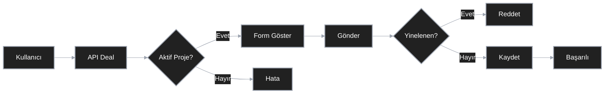

# Serverless Data Collection & Validation System
[Click to read in English (İngilizce okumak için tıklayın)](readme.md)
## Sunucusuz Veri Toplama ve Doğrulama Sistemi

Modern yatırım süreçleri genellikle parçalı ve hata eğilimli veri toplama iş akışlarından muzdariptir. Bu proje, uçtan uca ön satış operasyonlarını dijitalleştirerek, veri bütünlüğünü önceliklendirerek ve Google Sheets'i başvuru yönetimi için dinamik bir veritabanı olarak kullanarak bu zorlukları ele almaktadır.

## 1. Amaç ve Yaklaşım

Temel amaç, topluluk odaklı yatırım başvurularını merkezileştirirken hız, veri doğruluğu ve operasyonel basitliği sağlamaktır. Mimari, basit form gönderiminin ötesine geçer, dinamik proje yönetim mekanizmaları uygular ve en yüksek veri kalitesi standartlarını korumak için yinelenen girişleri önler.

## 2. Operasyonel Mimari ve Veri Stratejisi

Sistem, Google Sheets'ten veri çıkarma, doğrulama ve işlemenin üç temel aşaması üzerinden çalışır:

- **Dinamik Veri Çıkarma**: Uygulama, görünürlük bayraklarını kullanarak Sheets'teki aktif yatırım fırsatlarını (deals) dinamik olarak filtreler ve kullanıcılara yalnızca ilgili seçenekleri sunar.

- **İş Kuralları ve Doğrulama**: Veri kirliliğini önlemek için sistem, uygulama katmanında doğrulama uygular. Aynı cüzdan adresinden aynı proje için yapılan yinelenen göndermeler, veritabanı seviyesine ulaşmadan engellenir.

- **Yazma ve Raporlama (Load)**: Başarıyla doğrulanan form verileri, zaman damgalarıyla merkezi tabloya yazılır ve operasyon ekipleri için gerçek zamanlı raporlamayı mümkün kılar.

### 2.1. Sistem Akış Diyagramı

## 3. Veri Kaynakları ve Akış Modeli

Aşağıdaki tablo, sistem içindeki veri trafiği kaynaklarını ve işleme yöntemlerini özetlemektedir:

| Sayfa | İşlev | Veri Yönü | Teknik Yaklaşım |
| :--- | :--- | :--- | :--- |
| **Deals** | Aktif Proje Yönetimi | Giriş (Read) | Dinamik Filtreleme (Active Flag) |
| **Submissions** | Başvuru Depolama | Çıkış (Write) | Row-based Append |
| **API Layer** | Entegrasyon & Güvenlik | Hibrit | googleapis SDK Entegrasyonu |

## 4. Teknik Altyapı ve Veri İşleme

Proje, düşük gecikmeli, ölçeklenebilir bir sunucusuz mimari üzerine inşa edilmiştir.

### 4.1. Dinamik Proje Yönetimi (/api/deal)

Statik bilgi görüntülemek yerine, uygulama her yüklendiğinde Deals sayfasını API aracılığıyla sorgular.

- **Mantık**: Başlık satırından sonra "isActive" değeri true, 1 veya yes olan ilk projeyi seçer.

### 4.2. Yazma Stratejisi ve Tekillik Kontrolü (/api/submit)

Yinelenen verilerin analizi bozmasını önlemek için, gönderim sırasında aşağıdaki teknik protokol uygulanır:

- **Arama**: Submissions sayfasındaki mevcut kayıtlar taranır.
- **Karşılaştırma**: DealName + WalletAddress kombinasyonu kontrol edilir.
- **Karar**: Kombinasyon mevcutsa, "zaten gönderildi" hatası döndürülür; aksi takdirde veriler atomik olarak tabloya eklenir.

## 5. Teknoloji Yığını

Sistemin esnekliği ve hızı, modern yazılım standartları üzerine inşa edilmiştir:

- **Framework**: Next.js 15.3.4 & React 18.2.0
- **Veri Yönetimi**: Google Sheets API v4
- **Bulut Entegrasyonu**: Vercel (Deployment & Serverless Functions)
- **Kimlik Yönetimi**: Google Service Account (Private Key Authentication)

## 6. Kurulum ve Operasyonel Hazırlık

### 6.1. Yerel Geliştirme

1. Bağımlılıkları yükleyin: `npm install`
2. `.env.local` dosyasını yapılandırın (Sheet ID ve Service Account kimlik bilgilerini ekleyin)
3. Uygulamayı başlatın: `npm run dev`

### 6.2. Dağıtım

Vercel gibi platformlarda, `.env.local` dosyasındaki hassas veriler (Private Key, vb.) ortam değişkenleri olarak tanımlanmalıdır. `GOOGLE_SA_KEY` değeri, satır sonu karakterlerini (`\n`) koruyarak tek satır olarak girilmelidir.

## 7. Kritik Hata Mesajları ve UI Geri Bildirimleri

Kullanıcı deneyimi, operasyonel akış sürekliliğini sağlamak için net durum mesajları üzerine inşa edilmiştir:

- **Veri Çekme Hatası**: "Could not fetch deal data. Please try again later."
- **Yinelenen Giriş**: "You have already submitted for this deal."
- **Başarılı**: "Application submitted successfully!"

Bu mimari, karmaşık veri toplama süreçlerini basit, güvenilir ve sürdürülebilir bir sisteme dönüştürür.
